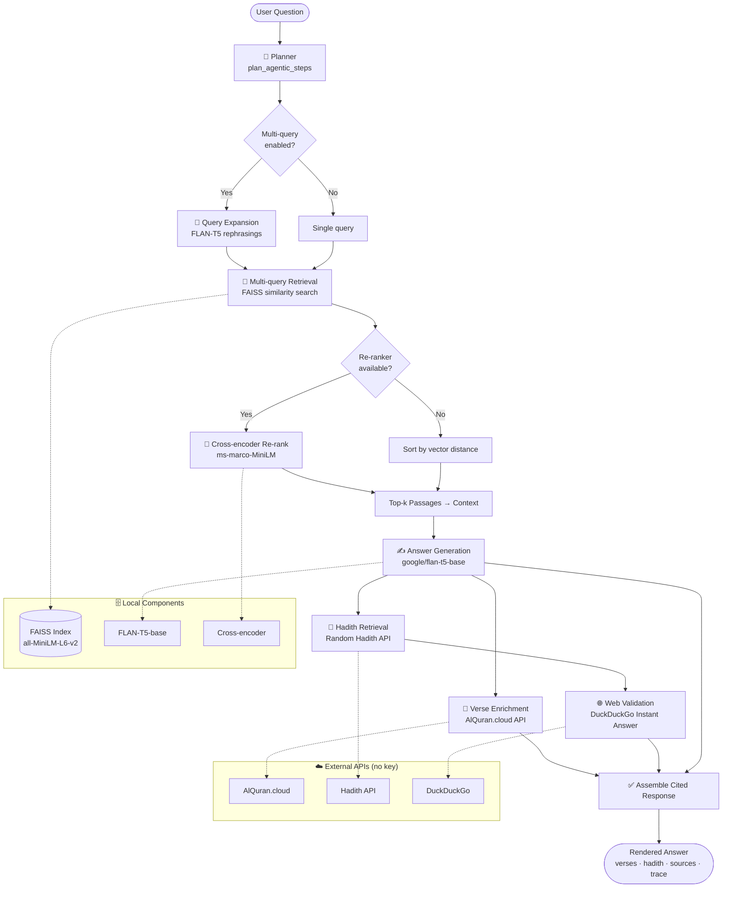

# 📖 Agentic Quran & Hadith Explorer

An **Agentic Retrieval-Augmented Generation (RAG)** assistant for exploring the Quran and Hadith. It combines a local FAISS vector index with multi-query expansion, cross-encoder re-ranking, and FLAN-T5 generation — then enriches answers with live Quranic verses (Arabic text, translation, and recitation audio), a related Hadith, and a best-effort web-based authenticity check.

Built with **Streamlit**, using only free, no-key public APIs.

> ⚠️ **Disclaimer:** Web-based Hadith validation is an automated *signal*, not a scholarly grading. Always confirm any ruling or grading with qualified Islamic scholars. This tool is for educational exploration only.

---

## ✨ Features

- **🧭 Agentic pipeline** — plans which tools to invoke based on the question's topic, then executes and assembles a cited, verified response.
- **🔁 Multi-query expansion** — rephrases your question several ways so passages worded differently are still retrieved.
- **🎯 Cross-encoder re-ranking** — re-scores candidates jointly with the query (`ms-marco-MiniLM`) for far more accurate top results than embedding distance alone. Falls back gracefully to vector order if unavailable.
- **📖 Verse enrichment** — detects Surah:Ayah references and fetches Arabic text, English translation, and recitation **audio** via AlQuran.cloud.
- **📜 Related Hadith** — pulls a topic-biased Hadith from public collections (Bukhari, Muslim, Abu Dawud, Ibn Majah, Tirmidhi).
- **🌐 Web validation** — cross-checks Hadith authenticity using DuckDuckGo's Instant Answer API as a heuristic signal.
- **🌙 Daily widgets** — Verse of the Day (with audio), Name of Allah of the day, and a daily streak counter.
- **🧩 Interactive quiz** — session-scored Quran knowledge quiz.
- **✨ 99 Names of Allah** — interactive grid with click-to-speak pronunciation via the browser's Web Speech API.
- **⭐ Productivity** — bookmarks, 👍/👎 feedback, 🔁 regenerate, 💡 follow-up suggestions, 🔍 searchable history, 📊 live stats, ⬇️ Markdown export, and 🎨 six color themes.
- **🧠 Transparent reasoning** — a step-by-step agent trace is shown for every answer.

---

## 🏗️ Architecture




## 🧰 Tech Stack

| Component        | Technology                                   |
| ---------------- | -------------------------------------------- |
| UI               | Streamlit                                    |
| Vector store     | FAISS (local)                                |
| Embeddings       | `sentence-transformers/all-MiniLM-L6-v2`     |
| Generator (LLM)  | `google/flan-t5-base`                        |
| Re-ranker        | `cross-encoder/ms-marco-MiniLM-L-6-v2`       |
| RAG framework    | LangChain                                    |
| Quran API        | AlQuran.cloud (verses, translation, audio)   |
| Hadith API       | random-hadith-generator                      |
| Web validation   | DuckDuckGo Instant Answer API                |

---

## 🚀 Getting Started

### Prerequisites

- Python 3.9+
- A prebuilt FAISS index in `quran_faiss_index/` containing `index.faiss` and `index.pkl`

### Installation

```bash
# Clone the repository
git clone https://github.com/<your-username>/<your-repo>.git
cd <your-repo>

# (Recommended) create a virtual environment
python -m venv venv
source venv/bin/activate        # On Windows: venv\Scripts\activate

# Install dependencies
pip install -r requirements.txt
```

### Suggested `requirements.txt`

```text
streamlit
torch
requests
langchain
langchain-community
langchain-huggingface
faiss-cpu
sentence-transformers
transformers
```

### Run

```bash
streamlit run app.py
```

Then open the local URL shown in your terminal (usually `http://localhost:8501`).

---

## ⚙️ Configuration

Key settings live at the top of the script:

| Variable                     | Default                                     | Description                                  |
| ---------------------------- | ------------------------------------------- | -------------------------------------------- |
| `FAISS_DIR`                  | `quran_faiss_index`                         | Path to the local FAISS index folder         |
| `EMBEDDING_MODEL`            | `all-MiniLM-L6-v2`                          | Embedding model for retrieval                |
| `LLM_MODEL`                  | `google/flan-t5-base`                       | Answer generation model                      |
| `RERANKER_MODEL`             | `cross-encoder/ms-marco-MiniLM-L-6-v2`      | Cross-encoder re-ranker                      |
| `RETRIEVAL_FETCH_MULTIPLIER` | `4`                                         | Candidate pool size multiplier before re-rank|
| `MAX_SUBQUERIES`             | `4`                                         | Original query + up to 3 rephrasings         |
| `HTTP_TIMEOUT`               | `20`                                        | Seconds per outbound request                 |

In-app sidebar controls let you adjust retrieved passage count, answer length, retrieval-quality toggles (multi-query, re-ranking), agentic tools (Hadith, web validation, verse enrichment), and color theme.

---

## 🧪 How the Agent Works (per question)

1. **Plans** which tools to use based on the question's topic.
2. **Expands** the question into several phrasings (multi-query).
3. **Retrieves** a wide candidate pool from the local FAISS index.
4. **Re-ranks** candidates with a cross-encoder for accuracy.
5. **Generates** a grounded answer with FLAN-T5.
6. **Enriches** detected verse references with Arabic, translation, and audio.
7. **Fetches** a related Hadith.
8. **Cross-checks** the Hadith's authenticity via web validation.
9. **Assembles** a cited, verified response with a reasoning trace.

---

## 📁 Project Structure

```
.
├── app.py                  # Main Streamlit application
├── quran_faiss_index/      # Local FAISS index (index.faiss + index.pkl)
├── requirements.txt
└── README.md
```

---

## 🤝 Contributing

Contributions, issues, and feature requests are welcome. Please open an issue to discuss substantial changes before submitting a pull request.

---

## 📜 License

Add your chosen license here (e.g. MIT). Note that the Quran/Hadith APIs used have their own terms of service.

---

## 🙏 Acknowledgements

- [AlQuran.cloud](https://alquran.cloud/) for verse text, translations, and recitation audio
- The public random-hadith API for Hadith content
- Hugging Face for the FLAN-T5, MiniLM embedding, and cross-encoder models
- The Streamlit and LangChain communities

> **Reminder:** This is an educational tool. For religious rulings and Hadith gradings, always consult qualified scholars.
